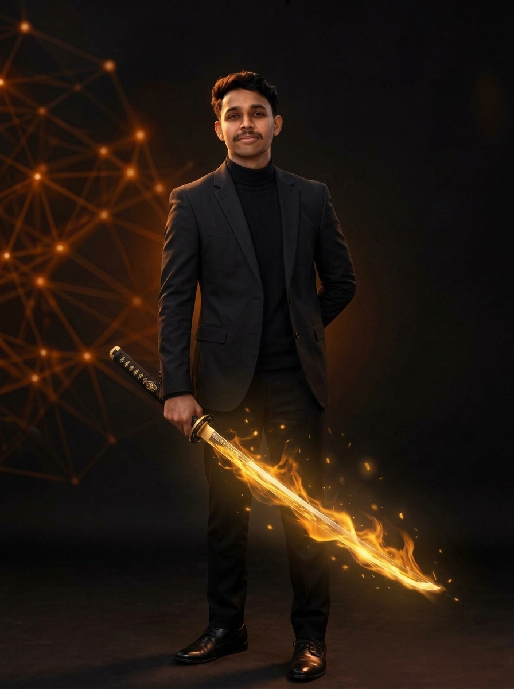
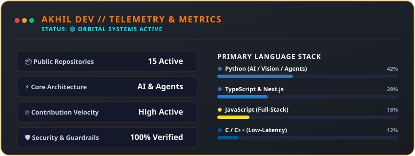

<div align="center">

<!-- 📸 Akhil Dev Portrait with Positive Power Katana -->
<a href="https://github.com/Akhil-Dev-Git">
  
</a>

<br/><br/>

<!-- 🚀 Master Header Banner -->

<br/>

<!-- ⚡ Continuous Keplerian Typing Headline -->
<a href="https://github.com/Akhil-Dev-Git">
  
</a>

<br/><br/>

<!-- 🧭 5-PAGE MULTI-DECK NAVIGATION SYSTEM -->
### 📑 EXPLORE THE 5-PAGE COMMAND DOSSIER

[](./docs/01_MISSION_CONTROL.md)
[](./docs/02_NEURAL_SYSTEMS.md)
[](./docs/03_PROJECT_CASE_STUDIES.md)
<br/>
[](./docs/04_ARSENAL_AND_STACK.md)
[](./docs/05_CONTACT_AND_COLLABORATION.md)

<br/><br/>

<!-- 🪐 Quick Telemetry & Status Badges -->
[](https://github.com/Akhil-Dev-Git)
[](https://github.com/Akhil-Dev-Git/Akhil-Dev-Portfolio)
[](https://linkedin.com)
[](https://github.com/Akhil-Dev-Git)

<br/>


</div>

---

## 🌌 The Gravitational AI Solar System

<div align="center">

<!-- Real-Time Animated AI Solar System -->


</div>

```rust
// 🌌 THE AKHIL DEV AI COSMOS
├── ☀️  SUN CORE        -> AKHIL DEV (Gravitational Center & AI Product Architect)
├── 🪐  ORBIT 1 (Gold)   -> Foundation LLMs: GPT-4o • Claude 3.5 Sonnet • Gemini 2.0
├── 🪐  ORBIT 2 (Purple) -> Agent Frameworks: LangGraph • CrewAI • LlamaIndex • MCP • AutoGPT
├── 🪐  ORBIT 3 (Cyan)   -> Inference & Vector RAG: Ollama • ChromaDB • HuggingFace • Pinecone • Qdrant • FAISS
├── 🪐  ORBIT 4 (Green)  -> Core AI & Vision: PyTorch • OpenCV • TensorFlow • MediaPipe • Scikit-Learn • FastAPI
└── 🪐  ORBIT 5 (Blue)   -> Full-Stack & Infra: Python • TypeScript • Next.js 15 • Docker • PostgreSQL • Redis • Linux
```

---

## ⚡ Featured Project Deployments

| Project Node | Telemetry | Tech Stack | Architectural Focus |
| :--- | :---: | :--- | :--- |
| 🛡️ **[Action-Guard-AI](https://github.com/Akhil-Dev-Git/Action-Guard-AI)** | `🟢 ACTIVE` | `TypeScript` `AI Security` `Node` | Autonomous tool-use safeguard & AST risk analysis |
| 🤖 **[local-ai-agent](https://github.com/Akhil-Dev-Git/local-ai-agent)** | `⚡ DEPLOYED` | `Python` `Ollama` `LangChain` | 100% private, air-gapped local LLM copilot |
| 👁️ **[Posture-Detection-System](https://github.com/Akhil-Dev-Git/Posture-Detection-System)** | `👁️ REALTIME` | `Python` `OpenCV` `MediaPipe` | Biomechanical landmark calculus & posture telemetry |
| 🗺️ **[AI-Trip-Planner](https://github.com/Akhil-Dev-Git/AI-Trip-Planner)** | `🗺️ PRODUCTION` | `React` `JavaScript` `AI APIs` | Spatial clustering & contextual itinerary generation |
| 🔒 **[Smart-Pay-Shield](https://github.com/Akhil-Dev-Git/Smart-Pay-Shield)** | `🛡️ SHIELDED` | `Python` `Scikit-Learn` `ML` | Transaction anomaly detection & risk scoring |
| 🌐 **[Akhil-Dev-Portfolio](https://github.com/Akhil-Dev-Git/Akhil-Dev-Portfolio)** | `✨ SHOWCASE` | `Next.js 15` `Three.js` `Tailwind` | Sensory 3D AI headquarters with 60 FPS motion |

> 📖 *For deep technical case studies with architecture diagrams, see [Page 03: Project Case Studies](./docs/03_PROJECT_CASE_STUDIES.md).*

---

## 📊 Live Telemetry & Activity Pulse

<div align="center">



<br/><br/>



<br/><br/>

<!-- Real-time Status Badges -->
[](https://github.com/Akhil-Dev-Git)
[](https://github.com/Akhil-Dev-Git?tab=repositories)
[](https://github.com/Akhil-Dev-Git)

</div>

---

<div align="center">
  
  <p>
    <sub>🚀 Engineered with mathematical precision by <b>Akhil Dev</b>. AI Systems Architect.</sub>
  </p>
</div>
