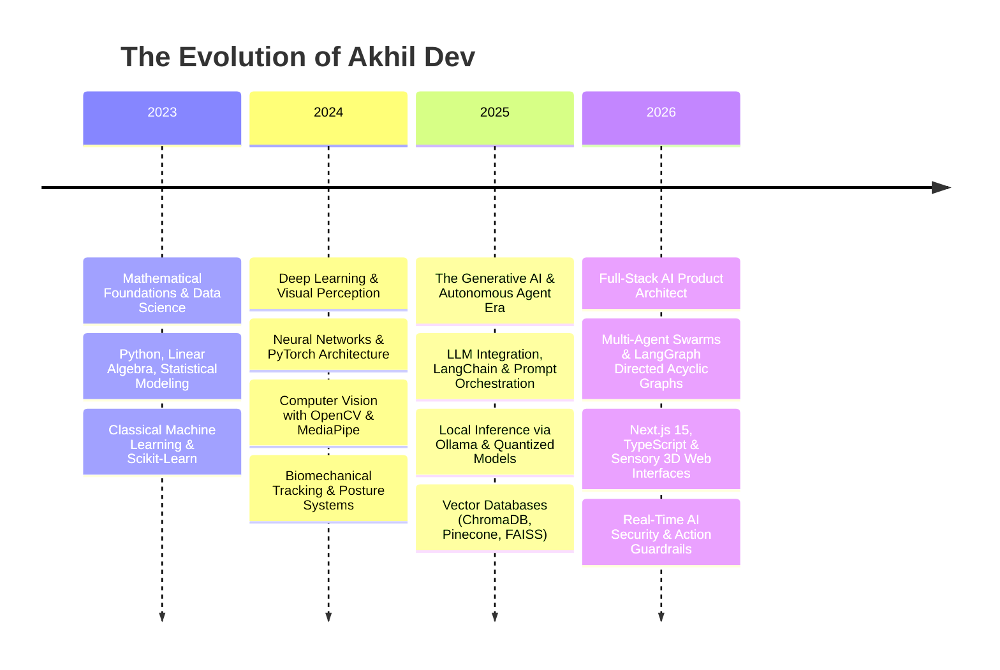

# 📜 Page 01: Mission Control & The Samurai Codex

  

---

## ⚔️ The AI Samurai Codex

> *"To engineer software is not merely to write syntax; it is the discipline of forging intelligent instruments that serve humanity with absolute precision, honor, and resilience."*

In ancient traditions, the katana was forged through repeated folding of high-carbon steel until zero impurities remained. In modern digital craftsmanship, complex AI models, agent swarms, and distributed full-stack systems are forged through rigorous testing, clean mathematical foundations, and uncompromising aesthetic execution.

### The Four Tenets of My Engineering Discipline

1. **Precision Over Hype (精)**
   - No black-box mysticism. Every generative model, agentic feedback loop, and neural pipeline must be deterministic in production, cost-effective, and bounded by verifiable safety guardrails.
2. **Speed with Form (速)**
   - Ship fast without architectural rot. Modular design patterns, decoupled microservices, and strict type safety ensure agility never compromises long-term system stability.
3. **Continuous Mastery (修)**
   - From low-level memory allocation in C/C++ to autonomous orchestration in LangGraph and local fine-tuning on Ollama, the warrior engineer commands the full vertical stack.
4. **Artistic Craftsmanship (美)**
   - User interfaces and developer experiences should evoke awe. Functionality without elegance is incomplete engineering.

---

## ⏳ Evolutionary Chronology (2023 — 2026)

---

## 🧭 Operational Matrix

| Dimension | Specification | Strategic Focus |
| :--- | :--- | :--- |
| **Primary Specialty** | AI Systems & Product Engineering | Autonomous Agents, Local LLM Runtimes, Real-Time Vision |
| **Language Hierarchy** | Python (Core AI), TypeScript (Core Web), C/C++ (Low Latency) | Polyglot execution based on latency and throughput trade-offs |
| **Design Standard** | Dark Minimalist, High Contrast, Kinetic | Inspired by Apple, Linear, Vercel, and modern cyber optics |
| **Deployment Ethos** | Local-First & Privacy Preserving | Self-hosted inference where feasible, fail-safe cloud redundancy |
| **Active Focus** | Multi-Agent Collaborative Systems | Self-correcting coding agents, autonomous research workflows |

---

  Page 01 of 05 • [Proceed to Deck 02: Neural Systems ➡](./02_NEURAL_SYSTEMS.md)

