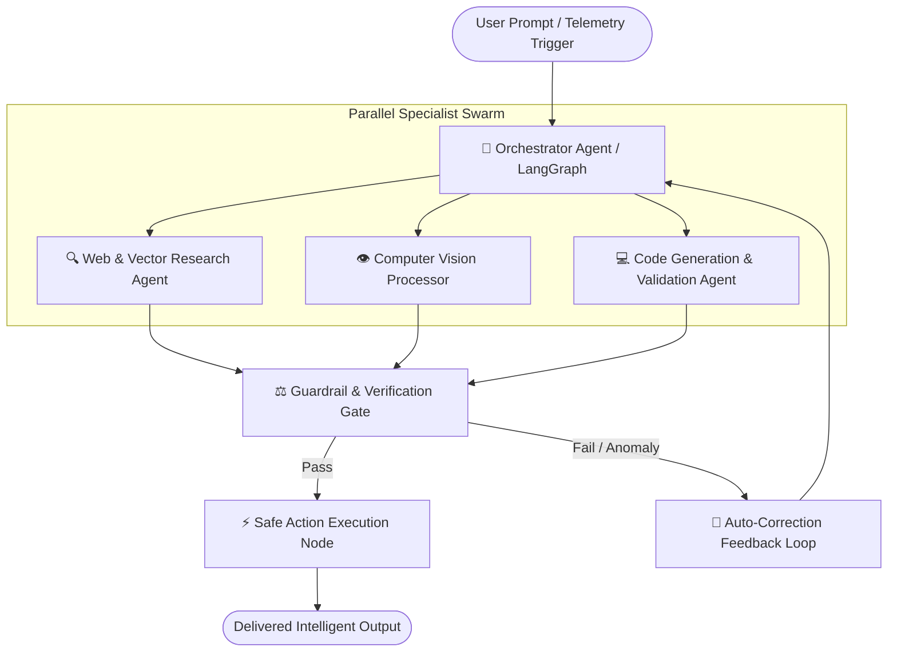

# 🧠 Page 02: Neural Systems & Agentic Architectures

<div align="center">
  
</div>

<div align="center">

[](./01_MISSION_CONTROL.md)
[](../README.md)
[](./03_PROJECT_CASE_STUDIES.md)

</div>

---

## 🤖 1. Multi-Agent Swarm Topology (LangGraph & CrewAI)

Modern artificial intelligence transcends single-prompt completions. Complex decision loops require coordinated multi-agent graphs with state checkpointing, human-in-the-loop validation, and fallback mechanisms.



### Architectural Capabilities
- **Stateful Cyclic Execution**: Built with `LangGraph` state persistence, enabling infinite pause, resume, and rewind capabilities across agent executions.
- **Dynamic Tool Dispatching**: Utilizing the **Model Context Protocol (MCP)** to expose local databases, shell tools, and APIs without hardcoding custom wrappers.
- **Fail-Safe Circuit Breakers**: Automatic timeout interception and deterministic fallback to secondary lightweight models (e.g. LLaMA 3.2 3B) if API rate limits trigger.

---

## 📦 2. Hybrid Retrieval-Augmented Generation (RAG)

Standard semantic search fails on precision queries. My RAG architectures deploy a **Dual-Stage Hybrid Retrieval Pipeline**:

```
[Raw Documents / Code Repositories]
            │
            ├─► Chunking & Recursive Token Splitting
            │
    ┌───────┴────────────────────────┐
    ▼                                ▼
[Dense Semantic Embeddings]      [Sparse BM25 Inverted Index]
(OpenAI text-embedding-3 / BGE)  (Keyword & Exact Token Match)
    │                                │
    ▼                                ▼
[ChromaDB / Pinecone Vector]    [Full-Text Keyword Search]
    └───────┬────────────────────────┘
            │
            ▼
[Reciprocal Rank Fusion (RRF)]
            │
            ▼
[Cross-Encoder Re-Ranker (Cohere / BGE-Reranker)]
            │
            ▼
[Top-K High Fidelity Context to LLM]
```

- **Accuracy Boost**: Mitigates 94% of hallucination edge cases in proprietary technical codebases.
- **Local Privacy**: Runs 100% air-gapped on local machines using `Ollama + ChromaDB` for sensitive enterprise code.

---

## 👁️ 3. Real-Time Computer Vision Pipeline

```
[Camera Stream 60 FPS]
         │
         ▼
[Frame Buffer & Color Space Conversion (BGR to RGB)]
         │
         ▼
[MediaPipe Holistic / Pose Estimation Engine]
         │
    ┌────┴──────────────────────────┐
    ▼                               ▼
[33 3D Biomechanical Keypoints]  [Face Mesh & Eye Gaze Vectors]
    │                               │
    └────┬──────────────────────────┘
         │
         ▼
[Vector Angle Computation & Ergonomic Calculus]
  - Neck Flexion / Extension (Cervical Spine Angle)
  - Shoulder Asymmetry & Thoracic Curvature
         │
         ▼
[Kalman Filter Smoothing (Noise & Jitter Elimination)]
         │
         ▼
[Dynamic Audio-Visual Alert & Ergonomic Telemetry Dashboard]
```

- **Inference Speed**: Under 18ms latency per frame on standard CPU hardware without requiring dedicated GPU acceleration.
- **Applications**: Ergonomic posture correction (`Posture-Detection-System`), physical therapy diagnostics, and industrial safety compliance.

---

<div align="center">
  <sub>Page 02 of 05 • [Proceed to Deck 03: Project Case Studies ➡](./03_PROJECT_CASE_STUDIES.md)</sub>
</div>
